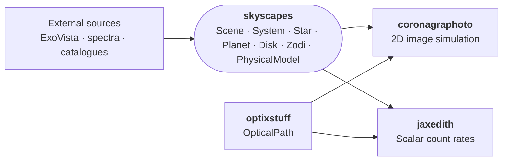

<p align="center">
  <a href="https://pypi.org/project/skyscapes/"></a>
  <a href="https://skyscapes.readthedocs.io"></a>
  <a href="https://github.com/coreyspohn/skyscapes/blob/main/LICENSE"></a>
  <a href="https://pypi.org/project/skyscapes/"></a>
</p>

# skyscapes

JAX-native astrophysical scene modeling for HWO direct imaging.

## What skyscapes is

`skyscapes` provides the **scene representation** that downstream HWO
simulation tools consume — a forward model that runs at variable
fidelity, from analytic sandbox models for fast iteration up to
research-grade physics for retrievals. High-fidelity scene generators
like [ExoVista](https://github.com/nasa/ExoVista) feed *into*
skyscapes through loaders (`from_exovista`); skyscapes does not try to
replace them.

- A `Scene` is "everything on the sky that the telescope sees" — one
  `System` (a star with planets and optionally a disk) plus optional
  background sources (zodiacal light, background galaxies, etc.).
- Source models (`Star`, `Planet`, `Disk`, physical models, backgrounds)
  are composable `eqx.Module`s — swap any one without touching the rest,
  or swap the whole class for a higher-fidelity variant.
- Loaders bridge external simulation outputs (ExoVista FITS) into the
  workspace via `from_exovista(...)`.

The same `Scene` flows through both the
[coronagraphoto](https://github.com/CoreySpohn/coronagraphoto) image
simulator and the [jaxEDITH](https://github.com/CoreySpohn/jaxedith)
ETC, so the astrophysical content is consistent across all downstream
science products.

## What skyscapes is *not*

- **Not a radiative transfer engine.** The `ExoJaxPhysicalModel` is a
  thin adapter over [ExoJAX](https://github.com/HajimeKawahara/exojax);
  skyscapes does not implement its own RT.
- **Not an orbit propagator.** Orbital mechanics live in
  [orbix](https://github.com/CoreySpohn/orbix); `Planet` composes an
  `AbstractOrbit` rather than reimplementing one.
- **Not a simulator.** Downstream tools
  ([coronagraphoto](https://github.com/CoreySpohn/coronagraphoto),
  [jaxEDITH](https://github.com/CoreySpohn/jaxedith)) consume a `Scene`
  to produce images / count rates.

## Ecosystem position



## Architecture

A `Scene` composes a `System` (star + planets + optional disk) with an
optional `Zodi` background:

- **Stars** — `Star` (wavelength- and time-dependent spectrum, ExoVista-
  backed) and `FlatStar` (constant-flux sandbox).
- **Planets** — `Planet` owns intrinsic params (`Rp_Rearth`,
  `Mp_Mearth`) and composes an `AbstractOrbit` (from orbix) with an
  `AbstractPhysicalModel`.
- **Physical models** — `LambertianPhysicalModel`,
  `GridPhysicalModel` (interpolated contrast cubes, used by ExoVista
  loader), `PrecomputedPhysicalModel` (cached reflectivity for hot
  loops), and `ExoJaxPhysicalModel` (full 2-stream RT via ExoJAX).
- **Disks** — `ExovistaDisk`, `ExovistaParametricDisk`, `GraterDisk`,
  `CompositeDisk`.
- **Backgrounds** — `AYOZodi` (AYO-convention defaults), `LeinertZodi`
  (full position-dependent Leinert+1998), `PrecomputedZodi` (cached
  flux array).

Every leaf is an `eqx.Module` PyTree, so JAX transforms (`jit`, `vmap`,
`grad`) compose end-to-end.

## Quick start

The easiest path is loading an ExoVista FITS file:

```python
from skyscapes import from_exovista

scene = from_exovista("path/to/exovista_system.fits")
```

Building one from scratch:

```python
import jax.numpy as jnp
from orbix.system.orbit import KeplerianOrbit

from skyscapes import Scene, System
from skyscapes.scene import FlatStar, Planet
from skyscapes.physical_model import LambertianPhysicalModel
from skyscapes.background import AYOZodi

star = FlatStar(
    Ms_kg=1.989e30,
    dist_pc=10.0,
    flux_phot_per_nm_m2=1e9,
)

orbit = KeplerianOrbit(
    a_AU=jnp.array([1.0]),
    e=jnp.array([0.0]),
    W_rad=jnp.array([0.0]),
    i_rad=jnp.array([jnp.pi / 3]),
    w_rad=jnp.array([0.0]),
    M0_rad=jnp.array([0.0]),
    t0_d=jnp.array([0.0]),
)
physical_model = LambertianPhysicalModel(Ag=jnp.array([0.3]))
planet = Planet(
    Rp_Rearth=jnp.array([1.0]),
    Mp_Mearth=jnp.array([1.0]),
    orbit=orbit,
    physical_model=physical_model,
)

zodi = AYOZodi(
    wavelengths_nm=jnp.linspace(400, 1000, 60),
    surface_brightness_mag=22.0,
)

scene = Scene(
    system=System(star=star, planets=(planet,)),
    zodi=zodi,
)
```

## Installation

```bash
pip install skyscapes
```

## Status

This package is in early development.
