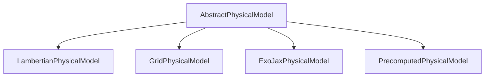

# Physical models

`skyscapes.physical_model` provides the **planet-to-star contrast**
model attached to every `Planet`. A physical model returns, given a
phase angle, star-planet distance, wavelength, and planet radius, the
dimensionless contrast $f_p / f_*$ that scales the host star's
spectrum into the planet's emitted flux. The submodule covers
atmospheric reflection, surface reflection, thermal emission, and
joint planet + atmosphere models.

## The hierarchy



All concrete classes implement a common `contrast` method that
returns the per-planet flux-ratio contrast at the given phase angle,
distance, wavelength, and planet radius (shape `(K, T)` for `K`
planets and `T` time steps). The differences are in physics fidelity
and computational cost.

Each physical model carries per-planet state as JAX arrays of length
`K`. Planet radius and mass are passed in at call time from the host
`Planet`; the model does not store them. Heterogeneous planets
(different physical-model classes) compose into a `System.planets`
tuple, with one `Planet` per physical-model type.

## Variants and when to use them

### `LambertianPhysicalModel`

Lambert phase function with constant geometric albedo. No wavelength
dependence; analytic and fast.

```python
import jax.numpy as jnp
from skyscapes.physical_model import LambertianPhysicalModel

model = LambertianPhysicalModel(Ag=jnp.array([0.3]))
```

**Use for**: first-pass forward modeling, sandbox / debugging,
closed-form sanity checks. Most-used variant in early-stage work.

### `GridPhysicalModel`

Wraps an externally computed contrast cube as a 2-D `interpax` spline
over `(wavelength, phase_angle)` per planet. Differentiable through
the interpolation. This is the model `from_exovista` populates.

```python
import jax.numpy as jnp
from skyscapes.physical_model import GridPhysicalModel

model = GridPhysicalModel(
    wavelengths_nm=jnp.linspace(400, 1000, 60),     # (n_wl,)
    phase_angle_deg=jnp.linspace(0, 180, 19),       # (n_phase,)
    contrast_grid=...,                              # (K, n_wl, n_phase)
)
```

**Use for**: tabulated atmospheres from grid-based RT codes;
ExoVista-loaded systems; comparison studies; when you have a
`(wl, phase) -> contrast` LUT and want it integrated with the rest of
the pipeline.

### `ExoJaxPhysicalModel`

Full ExoJax 2-stream radiative transfer. Computes reflectivity from
first principles given molecular mass mixing ratios (H2O, CO2, CH4,
O2, O3, ...). The full constructor exposes a lot of knobs; the
ergonomic entry point is `ExoJaxPhysicalModel.from_default_setup`:

```python
import jax.numpy as jnp
from skyscapes.physical_model import ExoJaxPhysicalModel

model = ExoJaxPhysicalModel.from_default_setup(
    log_mmrs={"H2O": jnp.array([-4.0]), "CO2": jnp.array([-3.5])},
    T_eq_K=jnp.array([288.0]),
    T_alpha=jnp.array([0.0]),
    log_surface_albedo=jnp.array([-1.0]),
    log_gravity_cgs=jnp.array([2.99]),
    wavelength_min_nm=400.0,
    wavelength_max_nm=1000.0,
)
```

**Use for**: research-grade physics; retrievals on real atmospheric
composition; joint atmosphere + orbit fitting workflows.

The first call triggers a HITRAN download and a 1-3 minute setup
(see `PrecomputedPhysicalModel` below to avoid this cost in inner
loops).

### `PrecomputedPhysicalModel`

Wraps an ExoJax model's full per-planet reflectivity grid as a fast
lookup. Once you've built the underlying `ExoJaxPhysicalModel`,
freeze it for inner-loop reuse:

```python
from skyscapes.physical_model import ExoJaxPhysicalModel, PrecomputedPhysicalModel

# One-shot RT computation
ej = ExoJaxPhysicalModel.from_default_setup(...)
cached = PrecomputedPhysicalModel.from_physical_model(ej)

# Use as a drop-in physical model
contrast = cached.contrast(
    phase_angle_rad=jnp.array([[jnp.pi / 3]]),   # (K, T)
    dist_AU=jnp.array([[1.0]]),                  # (K, T)
    wavelength_nm=550.0,
    Rp_Rearth=jnp.array([1.0]),                  # (K,)
)
```

`from_physical_model` currently supports `ExoJaxPhysicalModel` (the
classmethod calls the model's internal `_reflectivity_all_planets`).
The cache can also be persisted to disk via `.save(path)` and reloaded
via `PrecomputedPhysicalModel.load(path)`.

**Use for**: any time you need the same physical model in a hot inner
loop (forward simulation, MCMC sampling, multi-target evaluation).

## Composition with `Planet`

A `Planet` carries its intrinsic params (`Rp_Rearth`, `Mp_Mearth`)
plus an orbit and a physical model:

```python
import jax.numpy as jnp
from orbix.orbit import KeplerianOrbit
from skyscapes.scene import Planet
from skyscapes.physical_model import LambertianPhysicalModel

orbit = KeplerianOrbit(
    a_AU=jnp.array([1.0]),
    e=jnp.array([0.0]),
    W_rad=jnp.array([0.0]),
    i_rad=jnp.array([jnp.pi / 3]),
    w_rad=jnp.array([0.0]),
    M0_rad=jnp.array([0.0]),
    t0_d=jnp.array([0.0]),
)
physical_model = LambertianPhysicalModel(Ag=jnp.array([0.3]))
planet = Planet(
    Rp_Rearth=jnp.array([1.0]),
    Mp_Mearth=jnp.array([1.0]),
    orbit=orbit,
    physical_model=physical_model,
)
```

Heterogeneous physical models compose at the `System.planets` level
-- one `Planet` per model type, each batching its own `K` planets:

```python
lambertian_planet = Planet(
    Rp_Rearth=..., Mp_Mearth=...,
    orbit=lambertian_orbit,
    physical_model=LambertianPhysicalModel(...),
)
cached_planet = Planet(
    Rp_Rearth=..., Mp_Mearth=...,
    orbit=cached_orbit,
    physical_model=PrecomputedPhysicalModel.from_physical_model(...),
)
system = System(star=star, planets=(lambertian_planet, cached_planet))
```

## Performance budget

Approximate cost per planet per wavelength on GPU:

| Physical model | Per-call cost |
|---|---|
| `LambertianPhysicalModel` | ~0.01 ms |
| `GridPhysicalModel` | ~0.05 ms (interp lookup) |
| `PrecomputedPhysicalModel` | ~0.15 ms (1-D interp) |
| `ExoJaxPhysicalModel` | ~13 ms (full 2-stream RT) |

`PrecomputedPhysicalModel` is the right tool for inner loops where you
need ExoJax-quality physics but cannot afford 13 ms per evaluation.
Pre-compute once at simulation setup, then use the cached version for
all subsequent calls.

## Wavelength dependence

`contrast` accepts a scalar `wavelength_nm` or a 1-D array of
wavelengths. For an IFS-style spectral cube, pass the wavelength axis
directly:

```python
import jax
import jax.numpy as jnp

wavelengths = jnp.linspace(400, 1000, 100)
phase = jnp.array([[jnp.pi / 3]])    # (K=1, T=1)
dist  = jnp.array([[1.0]])           # (K=1, T=1)
Rp    = jnp.array([1.0])             # (K=1,)

contrast_spectrum = jax.vmap(
    lambda wl: model.contrast(phase, dist, wl, Rp),
)(wavelengths)
```

For `ExoJaxPhysicalModel` specifically, the RT routine is vectorised
internally, so `contrast_cube` runs at ~13 ms regardless of wavelength
count (up to ~100 wl bins).

## See also

- [Source models](source_models) -- `Planet` and the rest of the
  scene hierarchy
