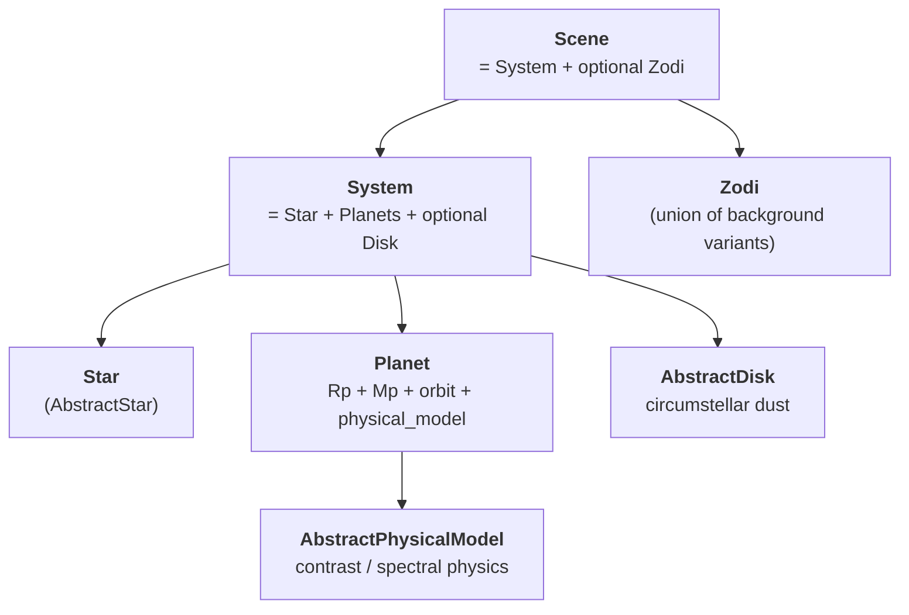

# Source models

skyscapes represents an astrophysical scene as a tree of `eqx.Module`
sources. This page covers what each source type is, how they compose,
and which variant to reach for in a given situation.

## The hierarchy



A complete `Scene` is:

```python
class Scene(eqx.Module):
    system: System              # required
    zodi: Zodi | None = None    # optional

class System(eqx.Module):
    star: AbstractStar
    planets: tuple[Planet, ...] = ()
    disk: AbstractDisk | None = None
    midplane_inc_deg: float = 0.0
    midplane_pa_deg: float = 0.0
    ...
```

Every level is an `eqx.Module`, which means: PyTree-registered for
JAX, fields are checked at construction, and `eqx.tree_at` works
end-to-end.

## Stars

Two concrete `AbstractStar` implementations:

| Class | When to use |
|---|---|
| `Star` | Canonical case: time- and wavelength-dependent stellar flux backed by an `interpax` 2-D spline. ExoVista-loaded systems use this. |
| `FlatStar` | Simplification: constant flux independent of wavelength or time. Sandbox / testing / closed-form sanity checks. |

```python
from skyscapes.scene import Star, FlatStar
import jax.numpy as jnp

# Realistic: wavelength + time dependence
star = Star(
    Ms_kg=1.989e30,
    dist_pc=10.0,
    wavelengths_nm=jnp.linspace(400, 1000, 60),
    times_jd=jnp.array([2_460_000.0, 2_460_730.5]),
    flux_density_jy=...,  # shape (n_wl, n_time)
)

# Sandbox: constant flux
flat = FlatStar(
    Ms_kg=1.989e30,
    dist_pc=10.0,
    flux_phot_per_nm_m2=1e9,
)

# Either implements the same interface
print(star.spec_flux_density(wavelength_nm=550.0, time_jd=2_460_365.0))
print(flat.spec_flux_density(wavelength_nm=550.0, time_jd=2_460_365.0))
```

`Star` is the canonical choice for any real target -- it ingests
ExoVista-style time- and wavelength-dependent flux tables. `FlatStar`
is the sandbox stand-in when you only need a single constant flux
value.

## Planets

`Planet` owns the planet's **intrinsic parameters** (`Rp_Rearth`,
`Mp_Mearth`) and composes two submodels: an orbit (from `orbix`) and
a physical model (from `skyscapes.physical_model`). The intrinsic
parameters live on `Planet` itself because they describe the planet,
not the submodel that happens to use them at evaluation time.

```python
import jax.numpy as jnp
from orbix.system.orbit import KeplerianOrbit

from skyscapes.scene import Planet
from skyscapes.physical_model import LambertianPhysicalModel

orbit = KeplerianOrbit(
    a_AU=jnp.array([1.0]),
    e=jnp.array([0.0]),
    W_rad=jnp.array([0.0]),
    i_rad=jnp.array([jnp.pi / 3]),
    w_rad=jnp.array([0.0]),
    M0_rad=jnp.array([jnp.pi / 4]),
    t0_d=jnp.array([0.0]),
)
physical_model = LambertianPhysicalModel(Ag=jnp.array([0.3]))
planet = Planet(
    Rp_Rearth=jnp.array([1.0]),
    Mp_Mearth=jnp.array([1.0]),
    orbit=orbit,
    physical_model=physical_model,
)
```

A single `Planet` instance carries `K` planets that share the same
orbit type and physical-model type -- every per-planet field
(``Rp_Rearth``, ``Mp_Mearth``, orbital elements, model parameters)
is an array of length `K`. This is the "per-Planet-type batching"
convention; heterogeneous planets (different physical-model classes)
go into `System.planets` as a tuple of `Planet` instances.

```python
# Two planets sharing a Lambertian physical model
two_planet = Planet(
    Rp_Rearth=jnp.array([1.0, 11.2]),
    Mp_Mearth=jnp.array([1.0, 317.0]),
    orbit=KeplerianOrbit(
        a_AU=jnp.array([1.0, 5.0]),
        e=jnp.array([0.0, 0.05]),
        # ... other elements as (K=2,) arrays
    ),
    physical_model=LambertianPhysicalModel(Ag=jnp.array([0.3, 0.5])),
)
```

## Disks

`AbstractDisk` has several concrete implementations under
`skyscapes.disk`:

| Class | What it is |
|---|---|
| `ExovistaDisk` | Disk loaded from an ExoVista FITS file; runtime-tabulated brightness map |
| `ExovistaParametricDisk` | Three-component Henyey-Greenstein fit to an ExoVista disk; differentiable surrogate |
| `GraterDisk` | Two-power-law density × Henyey-Greenstein scattering; parametric / synthetic |
| `CompositeDisk` | Sum of any other disks (e.g. main disk + a clump) |

Loaded disks (`ExovistaDisk`) capture real ExoVista physics but are
non-differentiable through the disk's morphology. Parametric disks
(`GraterDisk`, `ExovistaParametricDisk`) are fully differentiable --
you can take gradients of observables with respect to disk parameters.

```python
from skyscapes.disk import GraterDisk

disk = GraterDisk(
    sma_inner_au=2.0,
    sma_outer_au=10.0,
    alpha_in=2.0,
    alpha_out=-2.0,
    scale_height_au=0.1,
    flux_density_at_1au_jy_per_arcsec2=...,
    g_hg=0.3,
)
```

For retrievals on a real disk, fit `ExovistaParametricDisk` to the
ExoVista data once, then use the parametric form in the inference
loop.

## Zodi (backgrounds)

Backgrounds are anything in the field of view that is not part of the
planetary system itself. Currently zodiacal light is the only kind
modeled; the `skyscapes.background` submodule will grow to host
extragalactic background, scattered starlight, etc. as needed.

Three Zodi variants (each implements `spec_flux_density`):

| Class | What it is |
|---|---|
| `AYOZodi` | AYO-convention defaults: fixed V-band magnitude × Leinert wavelength-dependent colour correction. Position-independent (the AYO convention bakes in solar longitude 135 deg). |
| `LeinertZodi` | Full Leinert+1998 position-dependent model: surface brightness varies with ecliptic latitude and solar longitude. Use when telescope-orbit geometry matters. |
| `PrecomputedZodi` | Wraps an externally computed photon-flux array (e.g. from EXOSIMS) for fast lookup. Position arguments accepted but ignored. |

```python
from skyscapes.background import AYOZodi, LeinertZodi, PrecomputedZodi
import jax.numpy as jnp

# Sandbox / AYO-compatible
zodi = AYOZodi(
    wavelengths_nm=jnp.linspace(400, 1000, 60),
    surface_brightness_mag=22.0,
)

# Realistic position-dependent
zodi = LeinertZodi(reference_mag_arcsec2=22.0)

# Externally computed
zodi = PrecomputedZodi(
    wavelengths_nm=...,
    flux_phot_per_arcsec2=...,
    reference_mag_arcsec2=22.0,
)

scene = Scene(system=system, zodi=zodi)
```

The `Zodi` union type covers all three:

```python
from skyscapes.background import Zodi

def my_function(zodi: Zodi):
    # accepts any concrete Zodi variant
    ...
```

For the geometry inputs that `LeinertZodi.spec_flux_density` requires
(ecliptic latitude, solar longitude), see
[local zodi + telescope geometry](local_zodi_geometry).

## Physical models

Physical models (reflective, emissive, joint) are documented
separately -- see [physical models](physical_models).

## Composition

The same `Scene` is consumed by every downstream tool. Build it once,
use it everywhere:

```python
from skyscapes import Scene, System, from_exovista

# From ExoVista
scene = from_exovista("system.fits")

# Or programmatically
scene = Scene(
    system=System(star=star, planets=(planet,), disk=disk),
    zodi=zodi,
)

# Downstream usage
from coronagraphoto import system_readout
from jaxedith import compute_etc  # hypothetical API

image = system_readout(scene, optical_path, key, ...)
exposure_time_s = compute_etc(scene, optical_path, target_snr=7.0)
```

## See also

- [Physical models](physical_models) -- the physical-model hierarchy
- [Local zodi + telescope geometry](local_zodi_geometry) -- the
  Leinert geometry inputs
