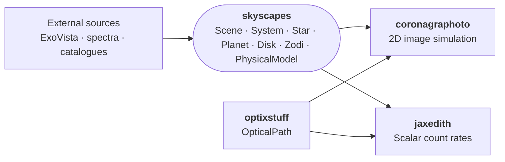

# skyscapes

JAX-native astrophysical scene modeling for HWO direct imaging.

`skyscapes` provides the **scene representation** that downstream
HWO simulation tools consume -- a forward model that runs at variable
fidelity, from analytic sandbox models for fast iteration up to
research-grade physics for retrievals. High-fidelity scene generators
like [ExoVista](https://github.com/nasa/ExoVista) feed *into* skyscapes
through loaders ({func}`~skyscapes.from_exovista`); skyscapes does not
try to replace them.

- A `Scene` is "everything on the sky that the telescope sees" --
  one `System` (a star with planets and optionally a disk) plus
  optional background sources (zodiacal light, background galaxies, etc.).
- Source models (`Star`, `Planet`, `Disk`, physical models,
  backgrounds) are composable `eqx.Module`s -- swap any one without
  touching the rest, or swap the whole class for a higher-fidelity
  variant.
- Loaders bridge external simulation outputs (ExoVista FITS) into
  the workspace via {func}`~skyscapes.from_exovista`.

The same {class}`~skyscapes.Scene` flows through both the
{mod}`coronagraphoto` image simulator and the
[jaxedith](https://github.com/CoreySpohn/jaxedith) ETC, so the
astrophysical content is consistent across all downstream science
products.

## Ecosystem position



## Quick start

The easiest path is loading an ExoVista FITS file into a `Scene`:

```python
from skyscapes import from_exovista

scene = from_exovista("path/to/exovista_system.fits")
```

Building one from scratch is a little more involved -- a `Scene`
composes a `System` (star + planets + optional disk) with an optional
`Zodi`, and `Planet` itself owns its intrinsic params (radius, mass)
and composes an orbit (from `orbix`) with a physical model:

```python
import jax.numpy as jnp
from orbix.orbit import KeplerianOrbit

from skyscapes import Scene, System
from skyscapes.scene import FlatStar, Planet
from skyscapes.physical_model import LambertianPhysicalModel
from skyscapes.background import AYOZodi

star = FlatStar(
    Ms_kg=1.989e30,
    dist_pc=10.0,
    flux_phot_per_nm_m2=1e9,
)

orbit = KeplerianOrbit(
    a_AU=jnp.array([1.0]),
    e=jnp.array([0.0]),
    W_rad=jnp.array([0.0]),
    i_rad=jnp.array([jnp.pi / 3]),
    w_rad=jnp.array([0.0]),
    M0_rad=jnp.array([0.0]),
    t0_d=jnp.array([0.0]),
)
physical_model = LambertianPhysicalModel(Ag=jnp.array([0.3]))
planet = Planet(
    Rp_Rearth=jnp.array([1.0]),
    Mp_Mearth=jnp.array([1.0]),
    orbit=orbit,
    physical_model=physical_model,
)

zodi = AYOZodi(
    wavelengths_nm=jnp.linspace(400, 1000, 60),
    surface_brightness_mag=22.0,
)

scene = Scene(
    system=System(star=star, planets=(planet,)),
    zodi=zodi,
)
```

## Installation

```bash
pip install skyscapes
```

## What you find here

**Scene primitives**:
- [`skyscapes.scene`](explanation/source_models) -- `Star`, `Planet`,
  `System`, `Scene`
- [`skyscapes.disk`](explanation/source_models) -- `AbstractDisk`,
  `ExovistaDisk`, `GraterDisk`, `CompositeDisk`, ...
- [`skyscapes.physical_model`](explanation/physical_models) --
  `LambertianPhysicalModel`, `ExoJaxPhysicalModel`,
  `GridPhysicalModel`, ...
- [`skyscapes.background`](explanation/source_models) -- `Zodi`
  (union), `AYOZodi`, `LeinertZodi`, `PrecomputedZodi`

**Loaders**:
- `from_exovista` (top-level) -- one-call ingestion of ExoVista FITS

**See also**:
- [Source models](explanation/source_models) -- what each source type
  represents and when to use which
- [Physical models](explanation/physical_models) -- the physical-model
  hierarchy (reflective, emissive, joint) and how contrast is computed
- [Local zodi + telescope geometry](explanation/local_zodi_geometry)
  -- the geometry required for position-dependent zodi models

```{toctree}
:maxdepth: 1
:caption: Explanation
:hidden:

explanation/source_models
explanation/physical_models
explanation/local_zodi_geometry
```

<!-- TODO(post-1.0): write tutorials/01_loading_a_scene and re-add a "Get started" toctree. -->


```{toctree}
:maxdepth: 2
:caption: API Reference
:hidden:

autoapi/skyscapes/index
```
